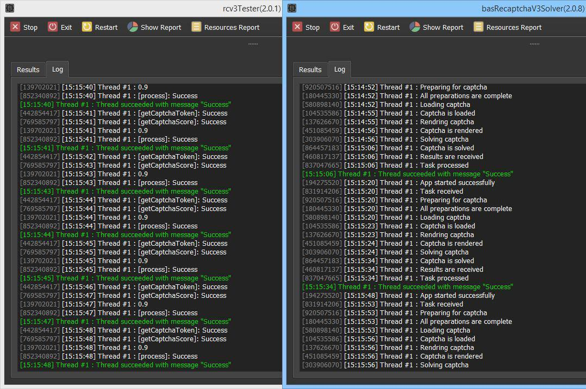

# ReCaptcha V3 Solver

Fastest, cheapest and highest quality ReCaptcha V3 solver.

Please ignore this app if you don't need it, or if you are satisfied with the results of the services, or the results of another similar apps.

## Features

### Solutions Quality

Score 0.9 for 99% of tokens (captcha solutions).
Guaranteed if conditions are met:

-   Good mobile or redirected proxies of any country, except RU.
-   Change of IP is obligatory after each solution
-   Repeated use of IP no more than 1 time in 2 hours

Hosting or any Russian ip's can't guarantee high solutions score.

### Speed of solutions

Less than a second per solution, starting from the second solved captcha.

Guaranteed under the conditions:

-   Proxies are fast enough.
    Sometimes solution time can reach 25 seconds.

### Low traffic consumption

On the average 25 kb per one solution of captchas.

### Change of IP by link

It can be useful for working with proxies having rotation by the link.

### Popular services API emulation

Supported:

-   RuCaptcha
-   2Captcha
-   Anticaptcha

To work with existing applications you need to replace API link of one of the above services, or add rules to system hosts file.

### Support for Enterprise version of captcha

## Other

This is a paid app. You can access it using the contacts below.

The functionality is guaranteed for the duration of the paid period.

There is no technical support for setup or anything else.

The application is delivered "as is" and if you are not happy with the use - there will be no refund.

Cost:

-   `24h free period`
-   `5$ / month, unlimited captchas`

Payment: `USDT (TRX/BSC)`

Contacts

-   https://t.me/sadzurami
-   mail.to.sadzurami@gmail.com
